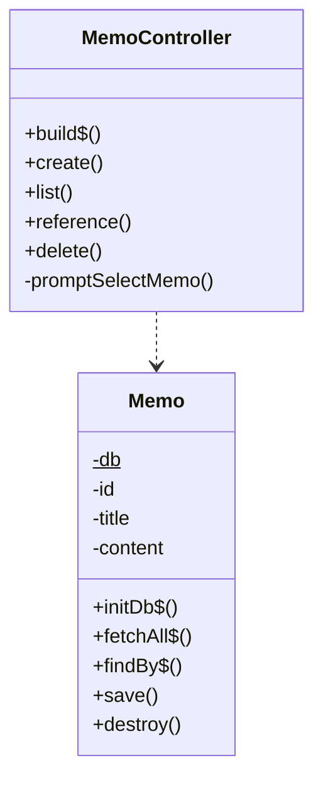

```mermaid
classDiagram
  class MemoController {
    +build$()
    +create()
    +list()
    +reference()
    +delete()
    -promptSelectMemo()
  }

  class Memo {
    -db$
    -id
    -title
    -content
    +initDb$()
    +fetchAll$()
    +findBy$()
    +save()
    +destroy()
  }

  MemoController ..> Memo
```
