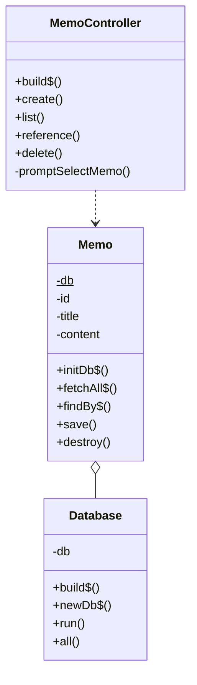

```mermaid
classDiagram
  class MemoController {
    +build$()
    +create()
    +list()
    +reference()
    +delete()
    -promptSelectMemo()
  }

  class Memo {
    -db$
    -id
    -title
    -content
    +initDb$()
    +fetchAll$()
    +findBy$()
    +save()
    +destroy()
  }

  class Database {
    -db
    +build$()
    +newDb$()
    +run()
    +all()
  }

  MemoController ..> Memo
  Memo o-- Database
```
